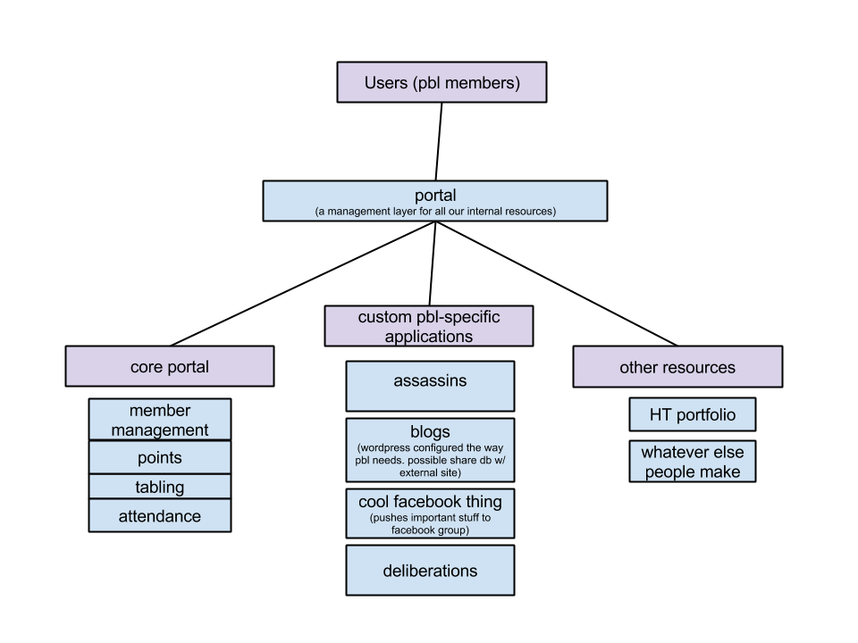

# PBL Members Portal
```
  _____  ____  _        _____           _        _ 
 |  __ \|  _ \| |      |  __ \         | |      | |
 | |__) | |_) | |      | |__) |__  _ __| |_ __ _| |
 |  ___/|  _ <| |      |  ___/ _ \| '__| __/ _` | |
 | |    | |_) | |____  | |  | (_) | |  | || (_| | |
 |_|    |____/|______| |_|   \___/|_|   \__\__,_|_|
```

# Overview

This project provides a clean interface into all of PBL's auxiliary resources and applications. Some examples of these are the blog, assassins, deliberations, and HT portfolio.
The core portal handles core features, which include __member management__, __events__, __attendance__, and __points__.

### PBL Tech Subprojects
* <a href='https://github.com/davidbliu/pbl-blog'>Blog</a>
* <a href='https://github.com/davidbliu/pbl-assassins'>Assassins</a>
* <a href='#'>HT Portfolio</a>


###PBL tech resource overview

</img>

# Design

# Developing
## Getting Started

__bundle install complications__

* __mysql__
 * sudo apt-get install libmysqlclient-dev  #(mysql development headers)


pbl members portal

rails 4
